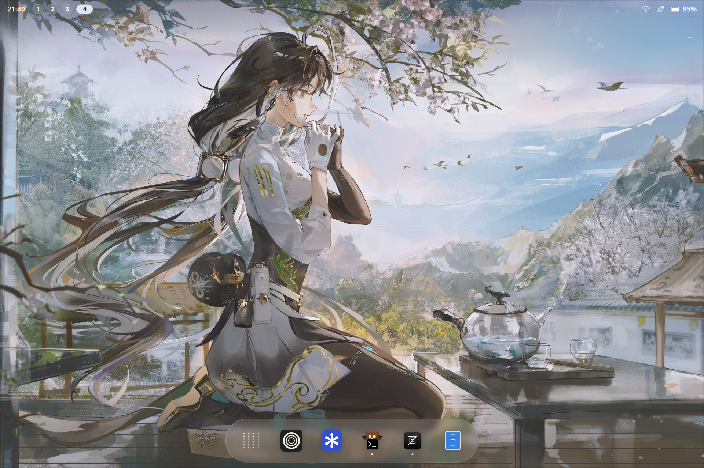
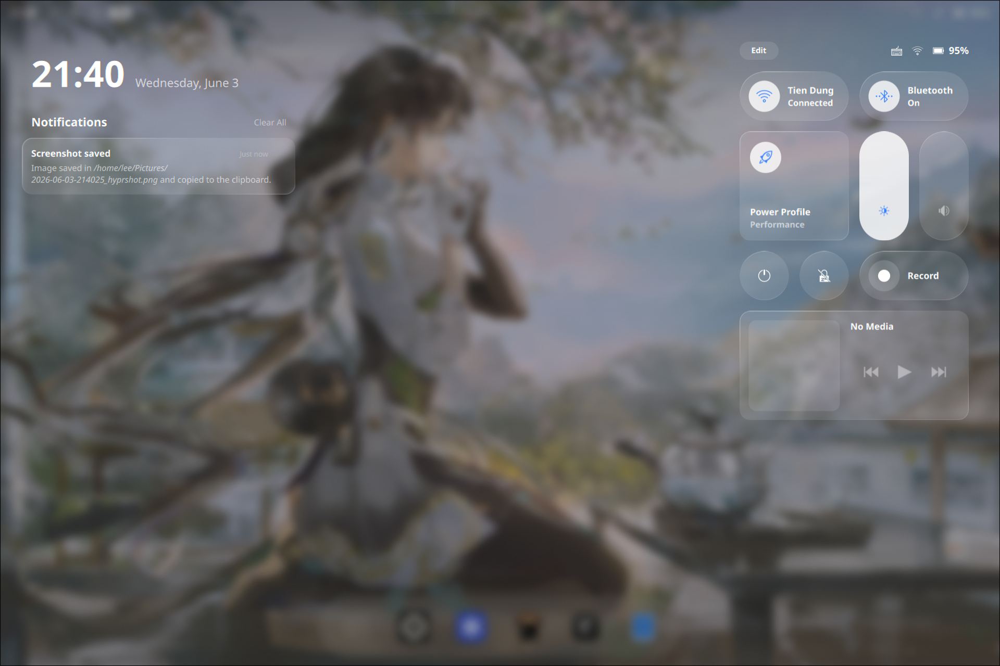
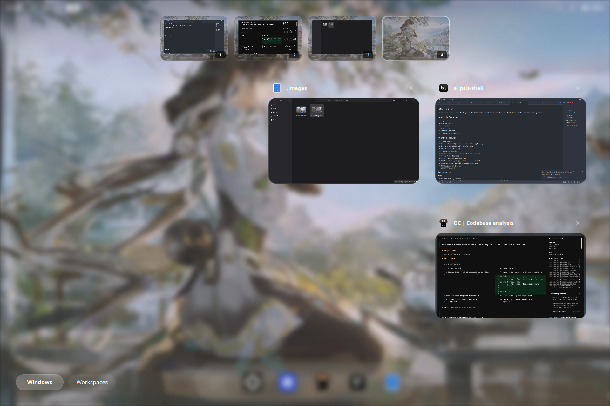

# Elipsis Shell

An interactive, touch-oriented desktop/tablet shell built with [Quickshell](https://quickshell.outfox.dev/). Inspired by iOS, Plasma Mobile, Android and more mobile operating systems.

<p align="center">
  
  
  
</p>

## Available Features
- Adaptive Dock
- Gesture Navigation
- App Drawer
- Task Switcher
- Volume/Brightness OSD
- Customizable Control Center

## Planned features
- Desktop widgets
- On-screen keyboard (OSK, could be a dedicated application)
- Live Status (kinda like One UI's Now Bar clone)
- Settings App (dedicated app)
- Customizable Status Bar
- Screenshot and annotation tool w/ integrated AI for OCR
- Optional AI assistant/chat
- Google's Circle to Search like feature
- More Lockscreen layouts (or a customizable lockscreen)
- Lockscreen widgets (probably uses desktop widgets)
- More navigation bar gestures
- Localization support 

### Dependencies

**Core**
- **Hyprland** (≥ v0.55) — compositor
- **Qt6** — `qt6-base`, `qt6-declarative`, `qt6-5compat`, `qt6-svg`, `qt6-labs-folderlistmodel`
- **Quickshell** (git) — shell framework
- **Breeze Icons** — icon theme

**System services**
- `NetworkManager` — networking
- `bluez` / `bluez-utils` — Bluetooth
- `pipewire` / `wireplumber` — audio
- `upower` — battery
- `hypridle` — idle management
- `awww` — wallpaper backend
- `gpu-screen-recorder` — screen recorder backend

See more in [Arch Linux install script](install-arch.sh).

## Installation

**Arch Linux** — run the install script:

```bash
git clone https://github.com/HxprLee/elipsis-shell && cd elipsis-shell/
chmod +x install-arch.sh
./install-arch.sh
```

**Other distributions** — install the [dependencies](#dependencies) listed above manually or in [Arch Linux install script](install-arch.sh) and copy the .config/ dir in the project to your user directory

### 3. Launch

```bash
qs
```


## Creating Custom Toggles

To create a custom toggle, create a new QML file in the `components/toggles/` directory. A simple toggle can be implemented in as few as 12 lines of code:

```qml
// MyToggle.qml
import QtQuick

Item {
    property bool isControlWidget: true
    property bool isSimpleToggle: true
    property string toggleName: "My Toggle"
    property string iconSource: shellRoot.icon("my-icon-symbolic")
    property bool isActive: false
    property color activeColor: Qt.rgba(0.2, 0.5, 1.0, 1.0)
    signal toggled()
    onToggled: { /* your logic */ }
}
```

More details in [Docs](docs.md).
